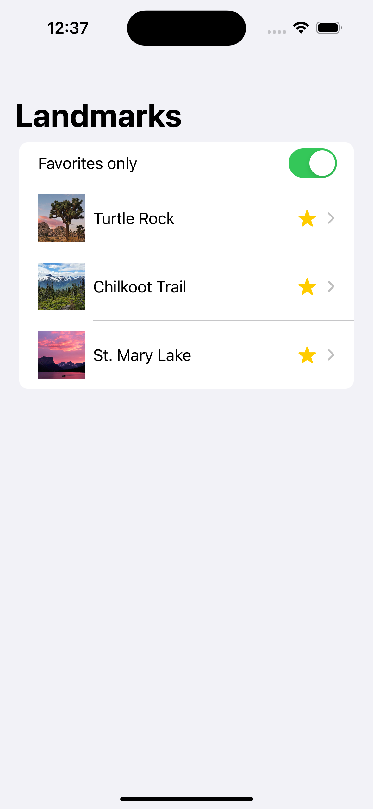

# Swift Tutorial and Experimentation
By Oscar Reyes
## Chapter 1: SwiftUI Essentials
I am following the SwiftUI Tutorials to start learning how to use Xcode to make Apps. They are made by Apple and you can find at this link: https://developer.apple.com/tutorials/swiftui

Chapter 1 in this tutorial consisted of learning how to use the basic features of the SwiftUI. It went through setting up some data flow, building navigation and making different views that could all be previewed in the Xcode preview.

### Final Results:

 
 

 
 

